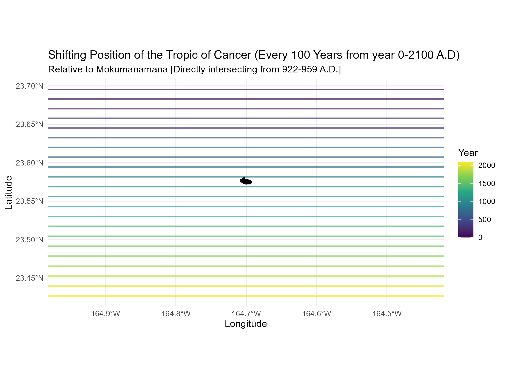

I was wondering how much does the latitude of the Tropic of Cancer actually changes through time. I calculated the position of the line through time relative to Mokumanamana.

  

*Figure 1. The shifting latitude of the Tropic of Cancer (every 100 years) relative to Mokumanamana.*

Use the slider below to explore how the Tropic of Cancer shifts through time:

<iframe src="assets/images/tropic_slider.html" width="100%" height="600px" style="border:none;"></iframe>

---

The north to south movement of the tropic is on an ~41,000 year cycle that intersected Mokumanamana recently.
The tropic was over the island from:

**922–959 A.D.**

---

## Why?

Becuase it's interesting- duh. 

No, it's because the position of the Tropic of Cancer is controlled by Earth's axial tilt (obliquity), which varies over time.

## Methods

- Built in **R** using `ggplot2`, `sf`, and `plotly`  
- Island outline derived as a KML data polygon from Google Earth  
- Tropic latitude calculated from an obliquity model  
